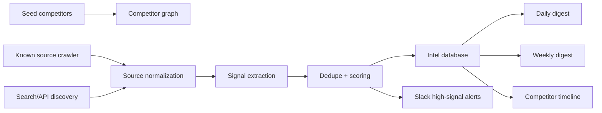

# Competitor Intel Bot Design

Date: 2026-06-09
Status: Approved design
Owner: Spaceflow internal tools

## Summary

Build a Slack-first Competitor Intel Bot for Spaceflow. The bot watches direct competitors in procurement AI and sourcing automation, detects high-signal market, product, and go-to-market changes, posts the important ones into Slack, and stores every accepted signal in its own database.

Slack is the feed. The database is the memory.

The first version is an internal Spaceflow bot, not a Specto product feature and not an open-source package. It should be built like PR Logger: a separate org-owned repository, deployable to Cloud Run, with professional docs, tests, and env-driven setup.

## Decisions Locked

- Wedge: Spaceflow internal Competitor Intel Slack bot.
- Domain: direct competitors in procurement AI and sourcing automation.
- Competitor discovery: hybrid. Start with a seed list, then propose candidate competitors.
- Coverage: full competitor radar.
- Storage: bot-owned database plus Slack feed.
- Competitor model: competitor graph with candidate approval.
- Delivery: real-time high-signal alerts plus daily and weekly digests.
- Sources: public-first with optional API connectors.
- Source engine: hybrid source engine. Known sources are crawled; search/API sources discover new signals.

## Goals

1. Capture competitor movement before it becomes stale.
2. Convert noisy web/news/source changes into actionable Spaceflow-specific signals.
3. Preserve source-backed memory so the team can ask, "What did this competitor do in the last 90 days?"
4. Grow the competitor graph without polluting the feed with unapproved companies.
5. Keep every Slack claim tied to one or more source URLs.

## Non-Goals

- No private scraping or credentialed LinkedIn scraping in V1.
- No automated outbound sales or marketing actions.
- No hallucinated competitor claims. Unsupported claims are discarded or marked low-confidence.
- No Specto frontend integration in V1.
- No open-source release in V1, though the repo should be clean enough to open later.

## Users

Primary users:

- Founders and product leads tracking competitor moves.
- Sales and GTM leads watching customer wins, pricing, positioning, and partnerships.
- Engineering/product team watching product launches, docs changes, integrations, and AI capabilities.

The user outcome is simple: the team should know what matters, why it matters, and what to do next without manually reading 50 sources.

## System Shape



## Main Components

### Competitor Graph

Stores approved competitors, candidate competitors, and the relationships between them.

Each competitor has:

- name
- canonical domain
- status: `seeded`, `approved`, `candidate`, `rejected`, `archived`
- category: `procurement_ai`, `sourcing_automation`, `supplier_intelligence`, `erp_procurement`, `workflow_agent`, `adjacent`
- ICP tags: enterprise, mid-market, manufacturing, retail, food service, etc.
- regions
- funding stage when known
- similarity score to Spaceflow
- monitoring priority

Candidates do not enter normal alerts until approved. They can appear in a digest section called "candidate competitors".

### Source Registry

Tracks known sources per competitor:

- homepage
- blog
- changelog
- docs
- pricing page
- case studies
- careers page
- GitHub org or public repos
- RSS feed
- Product Hunt page
- YC/company profile pages
- search query templates

Sources can be disabled individually if they become noisy.

### Collectors

Collectors produce normalized source documents. They do not decide what matters.

V1 collectors:

- `web_page`: fetch and diff known web pages.
- `rss`: read feeds.
- `github`: watch releases, commits, issues, public repo metadata if configured.
- `jobs`: watch careers pages or public job result pages.
- `search`: run scheduled discovery queries through an optional API.
- `manual_seed`: accept manually entered source URLs.

Optional APIs should be env-driven. If no search API is configured, the bot still works with known sources and RSS.

### Source Normalization

Every collector output becomes a `source_snapshot`:

- normalized title
- normalized body excerpt
- source URL
- fetched timestamp
- raw hash
- content hash
- source type
- competitor association if known

Hashing prevents reprocessing the same content.

### Signal Extraction

The extractor turns source snapshots into candidate signals.

Signal types:

- `funding`
- `acquisition`
- `partnership`
- `customer_win`
- `case_study`
- `product_launch`
- `feature_release`
- `integration`
- `ai_capability`
- `pricing_change`
- `positioning_change`
- `docs_change`
- `hiring_signal`
- `leadership_change`
- `new_competitor_candidate`

Each extracted signal must include:

- competitor or candidate competitor
- one-line claim
- short summary
- evidence snippets
- source URLs
- extraction confidence
- first seen timestamp

### Dedupe

Dedupe works at three levels:

1. Source snapshot dedupe by content hash.
2. Signal dedupe by competitor, signal type, claim fingerprint, and source URL.
3. Slack delivery dedupe by signal ID and digest run ID.

This avoids reposting the same launch from a blog post, news article, and RSS item unless each source adds materially new evidence.

### Scoring

Every signal gets four scores from 0 to 1:

- `relevance`: how close this is to Spaceflow's market.
- `novelty`: whether this is new, not just repeated coverage.
- `confidence`: whether the source and extraction are trustworthy.
- `impact`: whether this matters for strategy, sales, product, or hiring.

Composite score:

```text
score = 0.30 relevance + 0.25 impact + 0.25 confidence + 0.20 novelty
```

High-signal Slack alert:

- `score >= 0.75`, or
- `impact >= 0.85`, or
- signal type is `funding`, `acquisition`, `customer_win`, `pricing_change`, or `product_launch` with confidence at least `0.65`.

Low-score signals are stored but only appear in digests if they contribute to a pattern.

### Spaceflow Implication

Every Slack alert must answer "why this matters".

Allowed implication labels:

- `threat`
- `opportunity`
- `watch`
- `sales_enablement`
- `product_gap`
- `positioning`
- `ignore_for_now`

Suggested actions:

- `watch`
- `research`
- `update_battlecard`
- `share_with_sales`
- `review_product_gap`
- `ignore`

The bot should be direct. Example:

```text
Threat: Competitor X launched supplier onboarding agents. This overlaps with Spaceflow's AI procurement workflow pitch and may show up in enterprise demos.
Action: update battlecard and inspect their onboarding docs.
```

## Slack UX

### High-Signal Alert

Posts to `#competitor-intel` immediately.

Required fields:

- competitor
- signal type
- score
- confidence
- one-line claim
- why it matters for Spaceflow
- suggested action
- source links

Slack message shape:

```text
Competitor signal: Acme AI launched supplier risk workflow

Type: product_launch
Score: 0.84
Why it matters: overlaps with Spaceflow's supplier intelligence story.
Action: update battlecard
Sources:
1. https://...
2. https://...
```

### Daily Digest

Posts once per day.

Sections:

- top 5 signals
- new candidate competitors
- low-score pattern notes
- sources that failed repeatedly

### Weekly Digest

Posts once per week.

Sections:

- biggest threats
- strongest product gaps
- sales enablement updates
- candidate competitors to approve or reject
- competitor graph changes

## Admin UX

V1 can be CLI/env-first, with Slack buttons if implementation time allows.

Admin actions:

- add competitor
- approve candidate
- reject candidate
- add source
- disable source
- force refresh competitor
- generate competitor timeline

Slack interactivity is useful but not required for the first deploy. A simple admin command or script is enough if documented.

## Data Model

### `competitors`

- `id`
- `name`
- `canonical_domain`
- `status`
- `category`
- `icp_tags`
- `regions`
- `funding_stage`
- `similarity_score`
- `monitoring_priority`
- `created_at`
- `updated_at`

### `competitor_sources`

- `id`
- `competitor_id`
- `source_type`
- `url`
- `poll_interval_minutes`
- `enabled`
- `last_checked_at`
- `last_success_at`
- `failure_count`
- `created_at`
- `updated_at`

### `source_snapshots`

- `id`
- `source_id`
- `url`
- `title`
- `body_excerpt`
- `raw_hash`
- `content_hash`
- `fetched_at`
- `metadata`

### `intel_signals`

- `id`
- `competitor_id`
- `candidate_id`
- `signal_type`
- `claim`
- `summary`
- `spaceflow_implication`
- `suggested_action`
- `relevance_score`
- `novelty_score`
- `confidence_score`
- `impact_score`
- `composite_score`
- `status`: `new`, `posted`, `digested`, `dismissed`, `archived`
- `first_seen_at`
- `last_seen_at`
- `created_at`
- `updated_at`

### `signal_sources`

- `signal_id`
- `snapshot_id`
- `url`
- `evidence_excerpt`

### `competitor_candidates`

- `id`
- `name`
- `domain`
- `reason`
- `similarity_score`
- `source_urls`
- `status`: `pending`, `approved`, `rejected`
- `created_at`
- `resolved_at`

### `slack_deliveries`

- `id`
- `delivery_type`
- `signal_id`
- `digest_run_id`
- `channel`
- `message_ts`
- `thread_ts`
- `created_at`

### `digest_runs`

- `id`
- `digest_type`: `daily`, `weekly`
- `started_at`
- `completed_at`
- `signal_count`
- `slack_message_ts`

## Source Quality Rules

Primary sources score highest:

- competitor homepage
- competitor blog
- competitor changelog
- competitor docs
- public GitHub
- official press release

Secondary sources score lower:

- news articles
- funding databases
- Product Hunt
- founder social posts
- job listings

The bot can cite secondary sources, but high-impact claims should prefer primary confirmation when possible.

## Failure Handling

- If a source fetch fails, increment `failure_count` and retry later.
- If a source fails repeatedly, include it in daily digest admin notes.
- If extraction returns no supported claim, store the snapshot and skip Slack.
- If a signal has weak confidence but high possible impact, store it as `new` and include in digest as "needs review".
- If Slack posting fails, retry with delivery dedupe.

## Security And Compliance

- Secrets live in Secret Manager for Cloud Run.
- No user credentials are required in V1.
- No private LinkedIn scraping.
- Source snapshots store excerpts, not full pages, unless full-page retention is explicitly needed later.
- Every LLM-produced signal must cite source URLs and evidence snippets.
- The bot must never invent a competitor, claim, customer, funding amount, or feature.

## Deployment

Target deployment:

- Node.js TypeScript service
- Cloud Run
- Cloud SQL Postgres
- Cloud Scheduler for collector/digest triggers
- Slack bot token from Secret Manager
- optional search/API keys from Secret Manager

Repository:

- `Spaceflow-Technologies-INC/competitor-intel-bot`

## Testing

Minimum test coverage:

- config parsing
- competitor graph mutations
- source dedupe
- signal extraction fixture tests
- scoring thresholds
- Slack render snapshots
- digest generation
- collector failure handling
- candidate approval flow

Fixture-driven tests matter because intel quality is the product. A bot that summarizes but cannot prove its claims is worse than silence.

## V1 Rollout

Phase 1:

- Create repo and scaffold service.
- Implement config, Postgres store, Slack client, scheduler endpoints.
- Seed 5 to 10 competitors and known sources.

Phase 2:

- Implement known source crawler, RSS, and search connector abstraction.
- Implement deterministic extraction for obvious signal patterns.
- Add optional LLM extraction with strict JSON output and source evidence.

Phase 3:

- Implement scoring, dedupe, Slack high-signal alerts.
- Add daily digest.

Phase 4:

- Add candidate competitor flow.
- Add weekly digest and competitor timeline command.

## Open Questions For Implementation

These do not block the design:

1. Which optional search API should be enabled first?
2. What are the initial 5 to 10 seed competitors?
3. Should admin actions start as CLI scripts or Slack buttons?
4. Should Notion export be added after V1 or kept manual?

## Success Criteria

The bot is successful if, after two weeks:

- it posts fewer than 5 noisy alerts per week,
- every alert has source links,
- at least 3 alerts are useful enough to change a battlecard, demo, sales note, or product decision,
- the weekly digest can answer what changed for each tracked competitor,
- the team trusts the bot enough to add more competitors.
